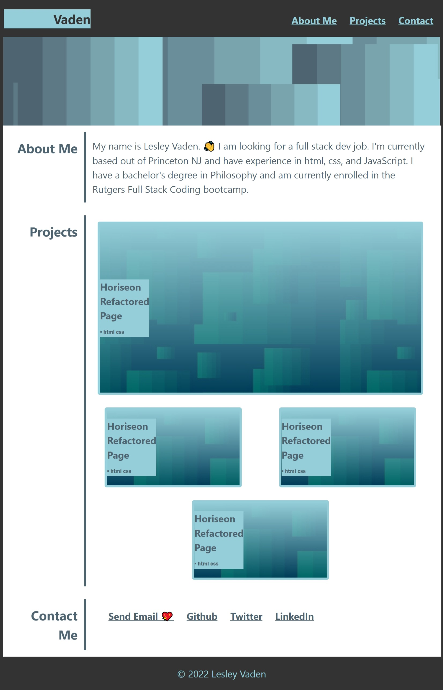

# lesley-byte-portfolio

## Description

I'm excited to showcase my skills, learn more and to consolodate my best work. This portfolio contains relevant work that may interest potential employers and showcases examples of my work so that the viewer has a reasonable starting place with which to determine my fit for their organization. It was a good excuse to practice css skills and have fun with GitHub.

## Table of Contents

- [Link to the page](https://lesley-byte.github.io/lesley-byte-portfolio/)
- [Screenshot](#screenshot)
- [Credits](#credits)
- [License](#license)
- [Badges](#badges)
- [Features](#features)
- [Tests](#tests)

## Usage

Visit it at:
[Link to page](https://www.lesleyvaden.dev)

## Screenshot

## Credits

- I would like to thank my tutor [Jacob Nordan](https://github.com/jnordan132) who tutored me through this and my fantastic instructors at the Rutgers Full Stack Coding Bootcamp.
- I would like to thank the [HTML Living Standard](https://html.spec.whatwg.org/multipage/).
- I would like to thank the Google speed test website checker [Google Speed Test Website Checker](https://pagespeed.web.dev/?utm_source=psi&utm_medium=redirect).
- I would like to thank the [Nu Html Checker](https://validator.w3.org/nu/).

## License

MIT License. See LICENSE file for the details.

## Badges

## Features

- html
- css
- Flexbox
- effort

## Tests

Test it on your mobile phone.
