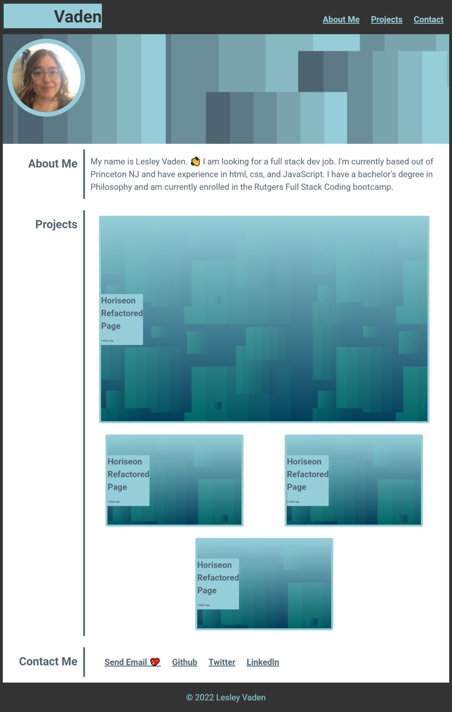

# lesley-byte-portfolio

## Description

I'm excited to showcase my skills, learn more and to consolodate my best work. This portfolio contains relevant work that may interest potential employers and showcases examples of my work so that the viewer has a reasonable starting place with which to determine my fit for their organization. It was a good excuse to practice css skills and have fun with GitHub.

## Table of Contents

- [Link to the page](https://lesley-byte.github.io/lesley-byte-portfolio/)
- [Screenshot](#Screenshot)
- [Credits](#credits)
- [License](#license)
## Usage

[Link to page](https://lesley-byte.github.io/lesley-byte-portfolio/)

Provide instructions and examples for use. Include screenshots as needed.

To add a screenshot, create an `assets/images` folder in your repository and upload your screenshot to it. Then, using the relative file path, add it to your README using the following syntax:
## Screenshot

## Credits

List your collaborators, if any, with links to their GitHub profiles.

If you used any third-party assets that require attribution, list the creators with links to their primary web presence in this section.

If you followed tutorials, include links to those here as well.

## License

MIT License. See LICENSE file for the details.

## Badges

## Features

- html
- css
- Flexbox
- effort 

## Tests

Test it on your mobile phone.
